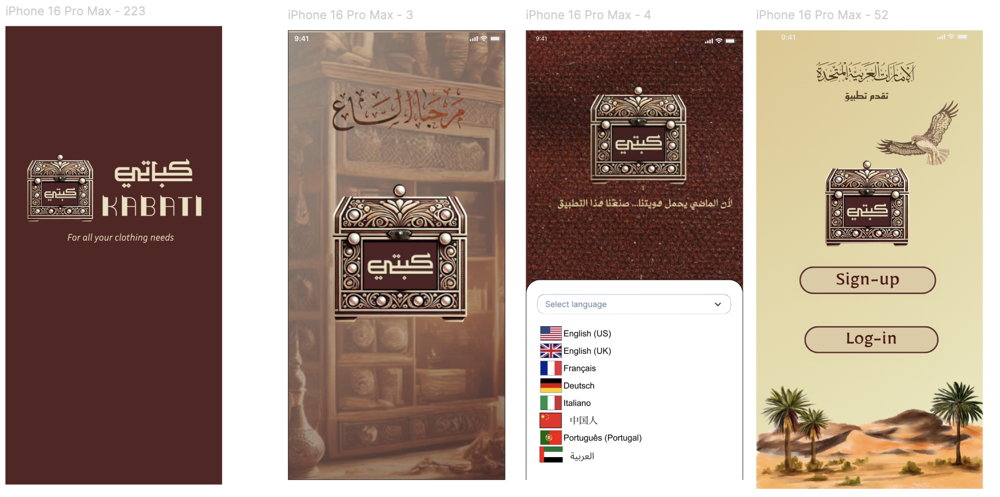
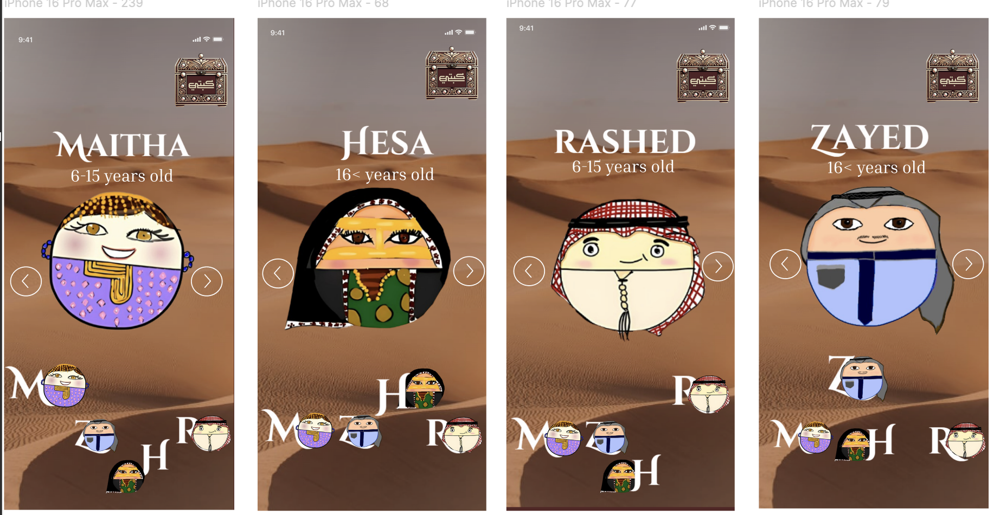
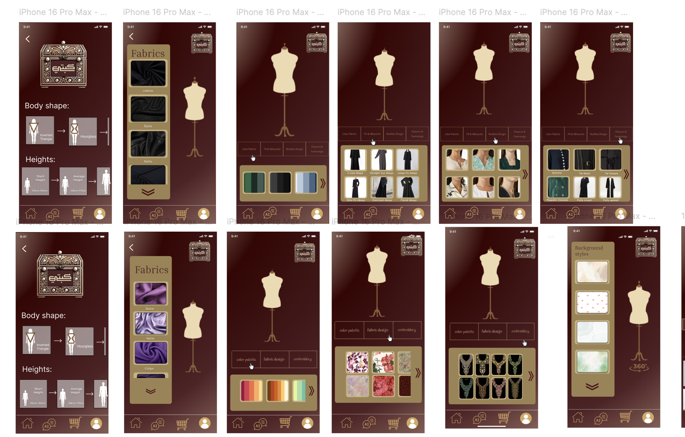
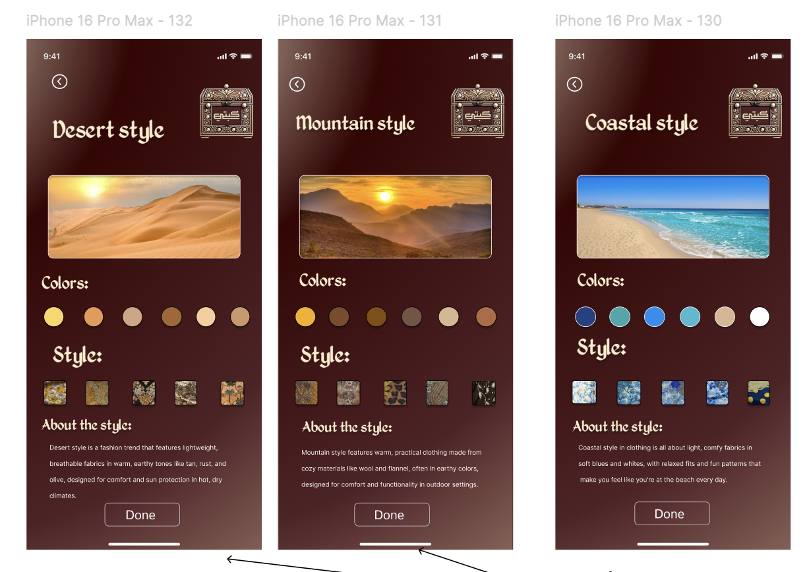
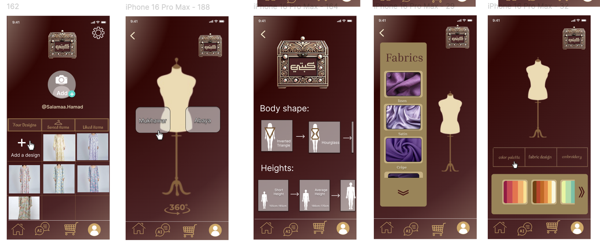
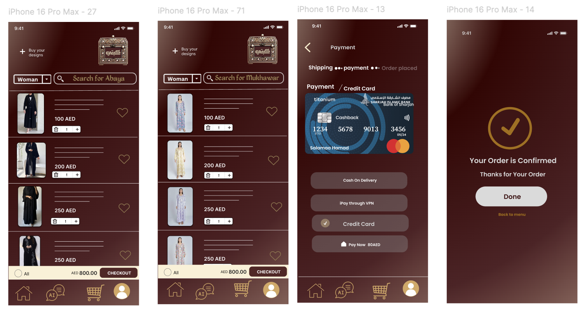
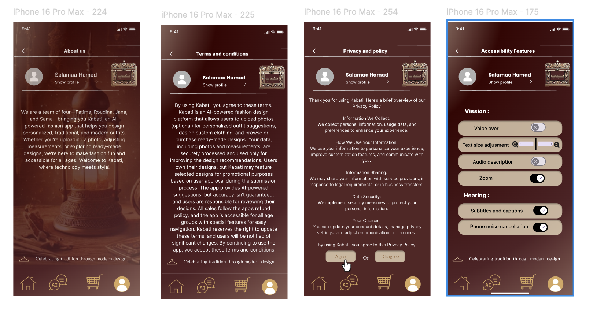

# Emirati Heritage Fashion

A comprehensive UI/UX design project created to preserve and promote Emirati fashion heritage by connecting traditional clothing and craftsmanship with a global audience.

## Overview

This project explores how digital design can help preserve Emirati fashion heritage while making traditional clothing and its cultural stories accessible to people around the world.

The platform brings together Emirati traditional fashion, cultural storytelling, craftsmanship, and a modern digital experience.

## My Role

I designed the complete user experience and visual interface of the platform, from user flows and screen layouts to interactive prototyping.

* UI/UX Design
* User Flow Design
* Wireframing
* Visual Design
* Interactive Prototyping
* Product Design

## Key Features

* Explore Emirati traditional clothing
* Discover the cultural stories behind different garments
* Browse traditional fashion and craftsmanship
* Connect Emirati heritage with a global audience
* Interactive product and discovery experiences
* Modern interface inspired by Emirati culture
* 
## 🎥 Demo

Watch a short demo showcasing the app's user experience and key features.

https://youtu.be/MFnbJqUxBow

## Full Interactive Prototype

https://www.figma.com/design/SvdxCKRbBdcBtD2ex9uTDO/Kabati?node-id=1-2&t=3kYk6KGGzO26hwks-1

The complete project contains **170+ designed screens** and an interactive prototype.

## 📱 Design Showcase

### Home

### Explore

### Clothing Details

### Emirati Heritage

### Designer & Craftsmanship

### Checkout

### Profile

## 🎨 Design System

The interface was designed to combine a modern digital experience with visual elements inspired by Emirati culture and traditional fashion.

## 🛠 Tools

* Figma
* UI/UX Design
* Prototyping

## 📌 Project Goal

To use digital product design to help preserve Emirati fashion heritage and introduce traditional clothing and craftsmanship to a wider global audience.
